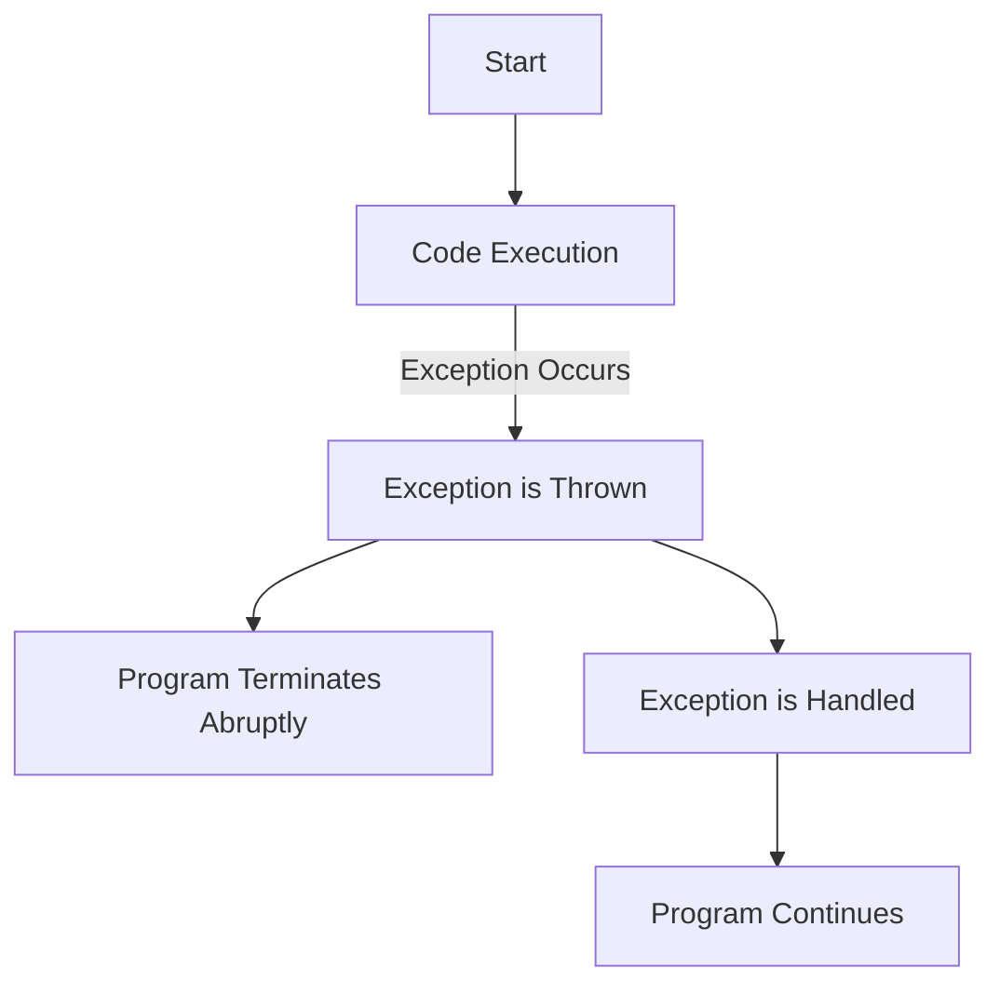
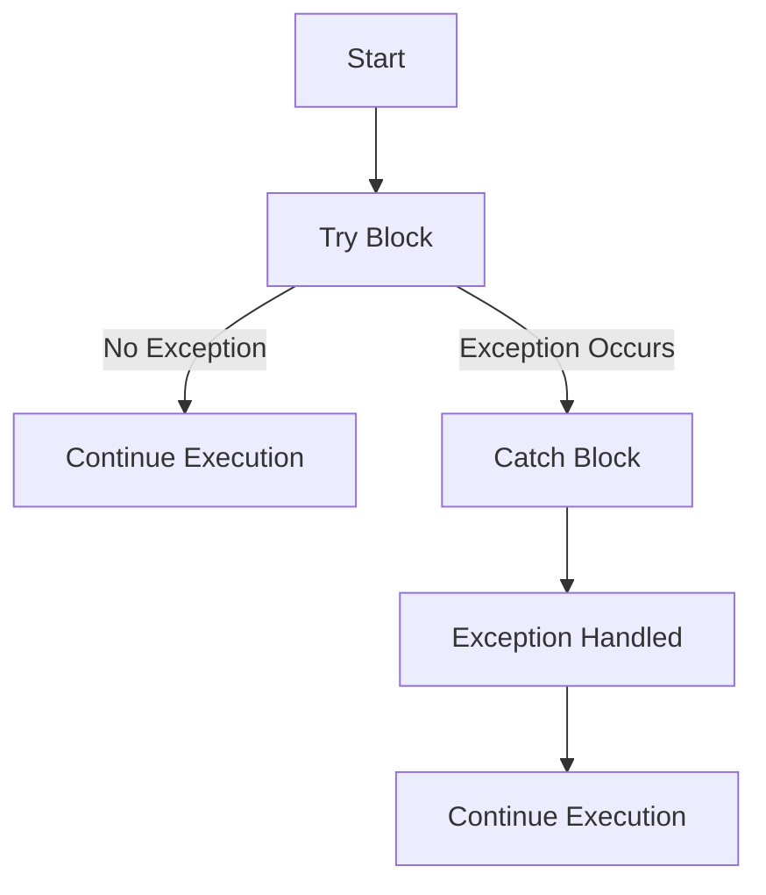
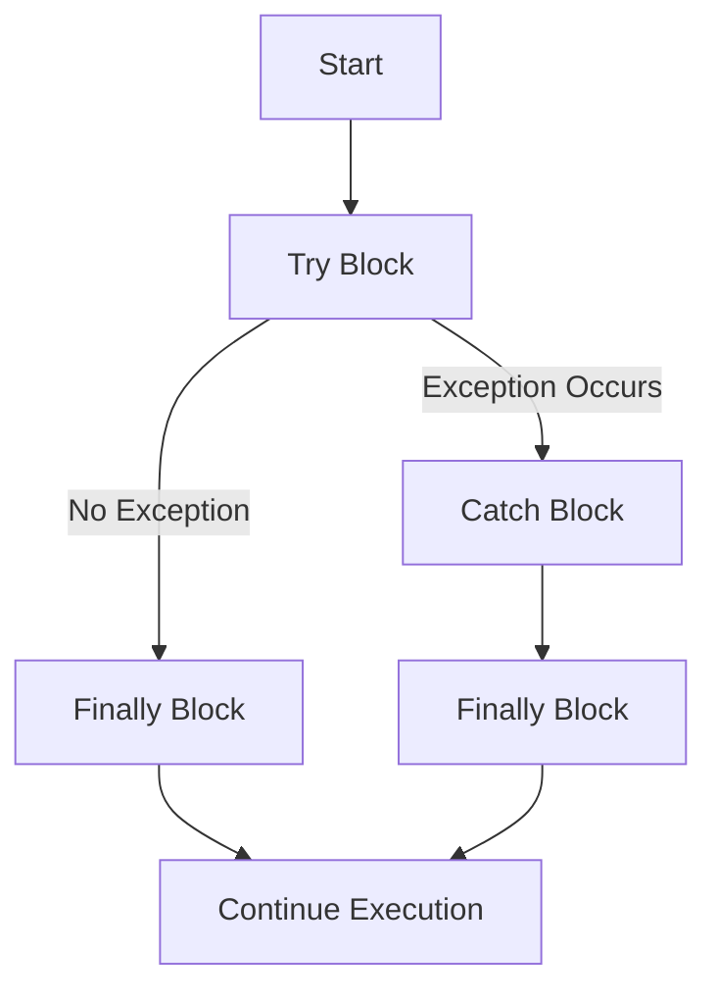
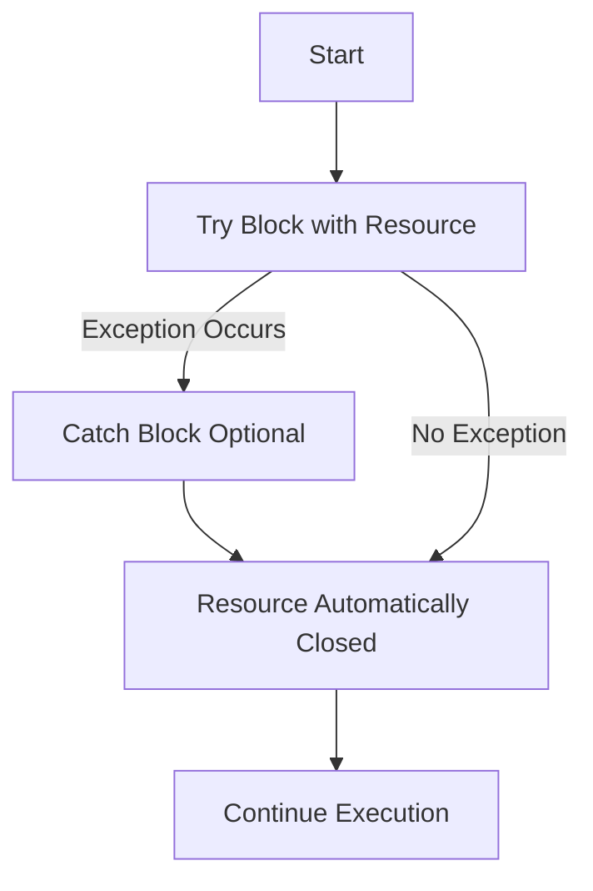
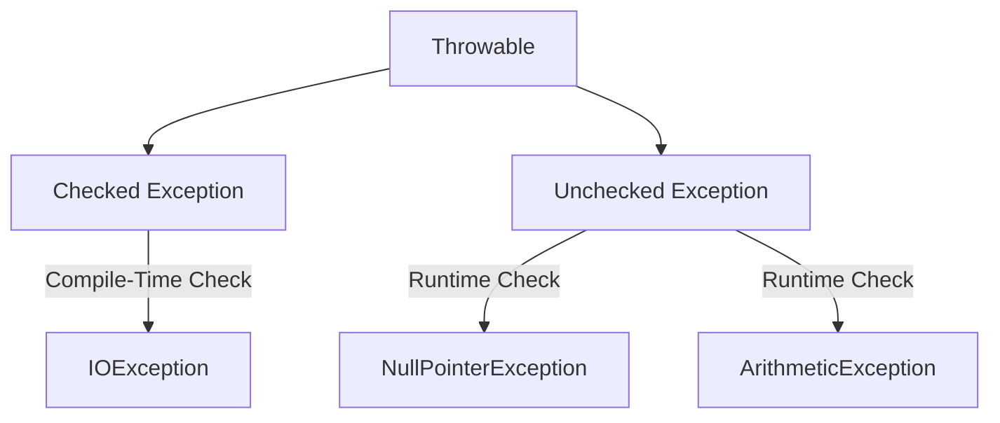
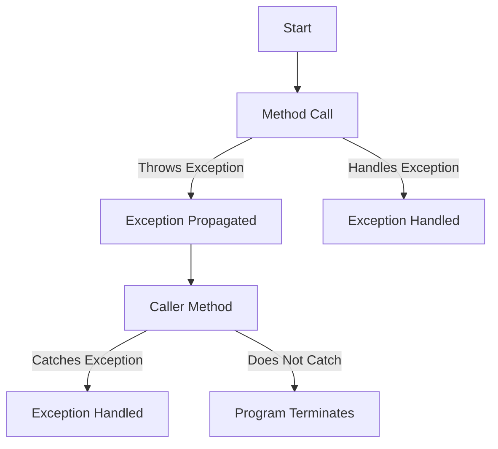
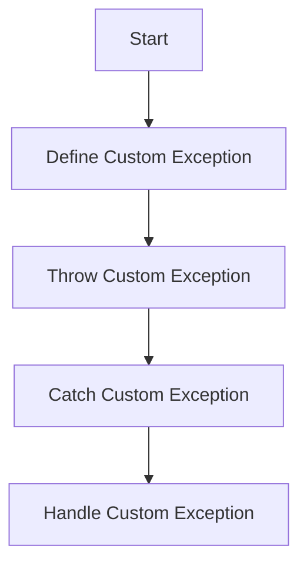
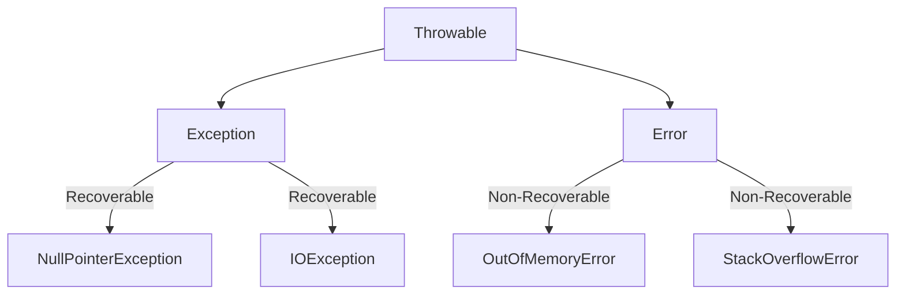

[](https://classroom.github.com/open-in-codespaces?assignment_repo_id=22818742)
# Java Exception Handling Lab

Java exceptions are events that occur during the execution of a program, they signal that an error or unexpected condition has occurred. Exceptions allow your program to handle these events gracefully rather than crashing. This lab is divided into several standalone sections, each containing 

    1. An Explanation
    2. An Example
    3. A DIY Exercise

You can complete each section below independently.

---

## Setup

Before you begin any section below please complete these steps:  
    
    1. Create a new Java package named `ie.atu.exceptions`. Use the **JAVA PROJECTS** pane on the left to create this package.
    2. Inside this package, create a class named `Main`.
    3. Insert the main method into the Main class.
    4. Add a simple print statement and execute the program to ensure everything is set up correctly.

---

## Agenda

1. [Introduction to Exception Handling](#1-introduction-to-exception-handling)
2. [Common Exceptions and try-catch Blocks](#2-common-exceptions-and-try-catch-blocks)
3. [finally Block](#3-finally-block)
4. [try-with-resources](#4-try-with-resources)
5. [Checked vs Unchecked Exceptions](#5-checked-vs-unchecked-exceptions)
6. [throw and throws Keywords](#6-throw-and-throws-keywords)
7. [Custom Exceptions](#7-custom-exceptions)
8. [Error vs Exception](#8-error-vs-exception)

---

## 1. Introduction to Exception Handling

### Explanation
Java exceptions are events that occur during the execution of a program and signal that an error or unexpected condition has occurred. They allow your program to respond gracefully rather than crashing.

#### Exception Handling Flowchart


### Example
```java
public class ExceptionIntroduction {
    public static void main(String[] args) {
        // This code will throw a NullPointerException because 'text' is null.
        String text = null;
        System.out.println(text.length());
    }
}
```

<details>
<summary>Expected Output</summary>

```
Exception in thread "main" java.lang.NullPointerException
    at ExceptionIntroduction.main(ExceptionIntroduction.java:4)
```

</details>

### DIY Exercise 🔦
- **Task**: Modify the above code so that it first checks whether `text` is `null` before attempting to access its length.
- **Hint**: Use an if-statement to verify if `text` is not `null`. If it is `null`, print a custom message instead of calling `length()`.

<details>
<summary>Expected Output</summary>

```
Text is null. Cannot retrieve length.
```

*Note: The output will depend on your custom message.*
</details>

---

## 2. Common Exceptions and try-catch Blocks

### Explanation
Java provides several built-in exceptions that represent common error conditions:
- **`NullPointerException`**: Occurs when you try to use a reference that points to no object.
- **`ArrayIndexOutOfBoundsException`**: Thrown when attempting to access an array with an invalid index.
- **`ArithmeticException`**: Happens when an illegal arithmetic operation is performed (for example, division by zero).
- **`IOException`**: Signals that an input/output operation has failed.

A try-catch block lets you execute code that might throw an exception and then catch and handle that exception without crashing the program. In the try block, you place the code that might fail; in the catch block, you handle the exception.

#### try-catch Block Flowchart


### Example
In this example, we intentionally trigger a `NullPointerException` by calling a method on a null reference. This demonstrates how to use a try-catch block to handle an exception.

```java
public class CommonExceptions {
    public static void main(String[] args) {
        String text = null;
        try {
            // This will throw a NullPointerException because 'text' is null.
            int length = text.length();
            System.out.println("Length: " + length);
        } catch (NullPointerException e) {
            System.out.println("Caught NullPointerException: " + e.getMessage());
        }
    }
}
```

<details>
<summary>Expected Output</summary>

```
Caught NullPointerException: null
```

*Note: The exact message may vary depending on your implementation.*
</details>

### DIY Exercise 🔦
- **Task**: Write a short Java program that intentionally triggers an `ArithmeticException` by performing a division operation that results in a division by zero. Use a try-catch block to handle the exception.
- **Hint**: Although the example above uses a `NullPointerException`, your solution should use an arithmetic operation that causes an `ArithmeticException`.

<details>
<summary>Expected Output</summary>

```
Caught ArithmeticException: / by zero
```

*Note: The output will depend on your specific implementation.*
</details>

---

## 3. finally Block

### Explanation
The `finally` block is used in conjunction with try-catch blocks. It executes code regardless of whether an exception was thrown or caught, and is often used for cleanup operations like closing files or releasing resources.

#### try-catch-finally Block Flowchart


### Example
```java
public class FinallyDemo {
    public static void main(String[] args) {
        try {
            int[] numbers = {1, 2, 3};
            System.out.println(numbers[5]); // This will throw an exception.
        } catch (ArrayIndexOutOfBoundsException e) {
            System.out.println("Caught exception: Index out of bounds!");
        } finally {
            System.out.println("Cleanup: This message prints regardless of exceptions.");
        }
    }
}
```

<details>
<summary>Expected Output</summary>

```
Caught exception: Index out of bounds!
Cleanup: This message prints regardless of exceptions.
```

</details>

### DIY Exercise 🔦
- **Task**: Create a program that simulates opening and processing a file. Use a try-catch block to handle a potential exception, and include a finally block that prints a message like "File processing complete."
- **Hint**: You may simulate file processing with print statements rather than actual file I/O.

<details>
<summary>Expected Output</summary>

```
Caught exception: [Exception message]
File processing complete.
```

*Note: The exception message will depend on your simulation.*
</details>

---

## 4. try-with-resources

### Explanation
The try-with-resources statement simplifies resource management by automatically closing resources when the try block is exited. It works with any object that implements the `AutoCloseable` interface, such as files or database connections.

#### try-with-resources Flowchart


### Example
```java
import java.util.Scanner;

public class TryWithResourcesScannerDemo {
    public static void main(String[] args) {
        try (Scanner scanner = new Scanner(System.in)) {
            System.out.print("Enter your name: ");
            String name = scanner.nextLine();
            System.out.println("Hello, " + name + "!");
        }
    }
}
```

<details>
<summary>Expected Output</summary>

```
Enter your name: Alice
Hello, Alice!
```

*Note: The output will depend on the user's input.*
</details>

### DIY Exercise 🔦
- **Task**: Write a program that uses try-with-resources to create a Scanner that reads an integer from the console and then prints the square of that number.
- **Hint**: Use a try-with-resources block to ensure the Scanner is closed automatically.

<details>
<summary>Expected Output</summary>

```
Enter a number: 5
Square: 25
```

*Note: The output will vary based on the input provided.*
</details>

---

## 5. Checked vs Unchecked Exceptions

### Explanation
Java exceptions are divided into two main categories:
- **Checked Exceptions**: These exceptions are checked at compile time. They must be either caught using a try-catch block or declared in the method signature with the `throws` keyword (e.g., `IOException`).
- **Unchecked Exceptions**: These are subclasses of `RuntimeException` (e.g., `NullPointerException`, `ArithmeticException`). They are not checked at compile time and typically indicate programming errors.

#### Checked vs Unchecked Exceptions Diagram


### Example
```java
import java.io.FileReader;
import java.io.IOException;

public class CheckedVsUnchecked {
    public static void main(String[] args) {
        // Checked Exception Example:
        try {
            FileReader reader = new FileReader("nonexistent.txt");
            System.out.println("File opened successfully");
        } catch (IOException e) {
            System.out.println("Caught checked exception: " + e.getMessage());
        }

        // Unchecked Exception Example:
        String text = null;
        // Uncomment to trigger an unchecked exception:
        // System.out.println(text.length());
    }
}
```

<details>
<summary>Expected Output</summary>

```
Caught checked exception: nonexistent.txt (No such file or directory)
```

*Note: The output for the unchecked exception depends on whether you uncomment the line.*
</details>

### DIY Exercise 🔦
- **Task**: Create a method that demonstrates both a checked and an unchecked exception:
  - For the checked exception, attempt to open a file that does not exist and handle the resulting `IOException`.
  - For the unchecked exception, try to access an element from an empty array and let the exception occur.
- **Hint**: Write separate code blocks in your method for each exception type, ensuring each is self-contained.

<details>
<summary>Expected Output</summary>

```
Caught checked exception: nonexistent.txt (No such file or directory)
Exception in thread "main" java.lang.ArrayIndexOutOfBoundsException: 0
    at YourClassName.methodName(YourClassName.java:XX)
```

*Note: The line numbers and class names will vary based on your implementation.*
</details>

---

## 6. throw and throws Keywords

### Explanation
- **`throw`**: Used to explicitly throw an exception within a method or block of code.
- **`throws`**: Declares that a method may throw one or more exceptions, which must then be handled by the calling code.

#### throw and throws Flowchart


### Example
**Using `throw`:**
```java
public class ThrowDemo {
    public static void main(String[] args) {
        try {
            validateAge(15); // This will throw an exception.
        } catch (IllegalArgumentException e) {
            System.out.println("Caught exception: " + e.getMessage());
        }
    }

    public static void validateAge(int age) {
        if (age < 18) {
            throw new IllegalArgumentException("Age must be at least 18.");
        }
        System.out.println("Age is valid.");
    }
}
```

**Using `throws`:**
```java
public class ThrowsDemo {
    public static void main(String[] args) {
        try {
            performOperation();  // This method declares it throws Exception.
        } catch (Exception e) {
            System.out.println("Exception handled: " + e.getMessage());
        }
    }

    public static void performOperation() throws Exception {
        throw new Exception("An error occurred.");
    }
}
```

<details>
<summary>Expected Output</summary>

For the `throw` example:
```
Caught exception: Age must be at least 18.
```

For the `throws` example:
```
Exception handled: An error occurred.
```
</details>

### DIY Exercise 🔦
- **Task**:  
  1. Create a method `calculateGrade` that accepts a student's score. If the score is negative or greater than 100, use `throw` to raise an `IllegalArgumentException` with the message "Invalid score."
  2. In your main method, call `calculateGrade` and use a try-catch block to catch and print the error message.
- **Hint**: Ensure that the method either handles the exception internally or declares it using `throws` so that the caller can handle it.

<details>
<summary>Expected Output</summary>

```
Caught exception: Invalid score
```

*Note: This output will appear if an invalid score is provided.*
</details>

---

## 7. Custom Exceptions

### Explanation
Custom exceptions allow you to create your own exception types to represent specific error conditions in your application. You create a custom exception by extending the `Exception` class (or one of its subclasses).

#### Custom Exception Flowchart


### Example
**Creating a custom exception:**
```java
public class InvalidAgeException extends Exception {
    public InvalidAgeException(String message) {
        super(message);
    }
}
```

**Using the custom exception:**
```java
public class CustomExceptionDemo {
    public static void main(String[] args) {
        try {
            registerUser(15); // This will throw an InvalidAgeException.
        } catch (InvalidAgeException e) {
            System.out.println("Error: " + e.getMessage());
        }
    }

    public static void registerUser(int age) throws InvalidAgeException {
        if (age < 18) {
            throw new InvalidAgeException("User must be at least 18 years old.");
        }
        System.out.println("User registered successfully.");
    }
}
```

<details>
<summary>Expected Output</summary>

```
Error: User must be at least 18 years old.
```
</details>

### DIY Exercise 🔦
- **Task**:  
  Create a custom exception called `InsufficientFundsException` (extending `Exception`). Then, write a `BankAccount` class that includes a `withdraw` method. If a withdrawal amount exceeds the account balance, throw the `InsufficientFundsException`.
- **Hint**: In the `withdraw` method, check if the withdrawal amount is greater than the balance and throw the exception with a suitable message if so.

<details>
<summary>Expected Output</summary>

```
Error: Insufficient funds. Withdrawal amount exceeds balance.
```

*Note: The exact wording depends on your implementation.*
</details>

---

## 8. Error vs Exception

### Explanation
Both **errors** and **exceptions** are subclasses of the `Throwable` class, but they are used for different scenarios:
- **Exceptions**: Represent conditions that a program can catch and handle, such as invalid input or missing files.
- **Errors**: Represent serious problems that are usually not handled by the application (e.g., `OutOfMemoryError`, `StackOverflowError`). They indicate issues in the runtime environment and are not meant to be caught by typical applications.

#### Error vs Exception Diagram


### Example
```java
public class ErrorVsExceptionDemo {
    public static void main(String[] args) {
        try {
            // The following line is commented out because errors are not typically caught.
            // throw new StackOverflowError("Simulated Error");
        } catch (Exception e) {
            System.out.println("Caught Exception: " + e.getMessage());
        }
        System.out.println("Program continues normally.");
    }
}
```

<details>
<summary>Expected Output</summary>

```
Program continues normally.
```
</details>

### DIY Exercise 🔦
- **Task**:  
  Write a short Java program that includes comments explaining why errors (such as `OutOfMemoryError`) are generally not caught by try-catch blocks. Optionally, simulate an error by writing a comment to throw an error, but do not actually throw it.
- **Hint**: Focus on writing clear code comments that explain the severity of errors compared to exceptions.

<details>
<summary>Expected Output</summary>

```
[No direct output, as the program includes only comments. The program should print "Program continues normally." if run.]
```
</details>

---

## Summary

In this lab, you learned about:
- **Exception Handling**: The mechanism for managing runtime anomalies.
- **Common Exceptions and try-catch Blocks**: How to use try-catch blocks to catch common exceptions.
- **finally Block**: How to execute cleanup code irrespective of exceptions.
- **try-with-resources**: How to automatically manage resources.
- **Checked vs Unchecked Exceptions**: The distinction between compile-time and runtime exceptions.
- **throw and throws**: How to explicitly throw exceptions and declare exception-throwing methods.
- **Custom Exceptions**: How to create your own exception classes.
- **Error vs Exception**: The differences between critical errors and manageable exceptions.

Enjoy exploring Java's exception handling mechanisms!
